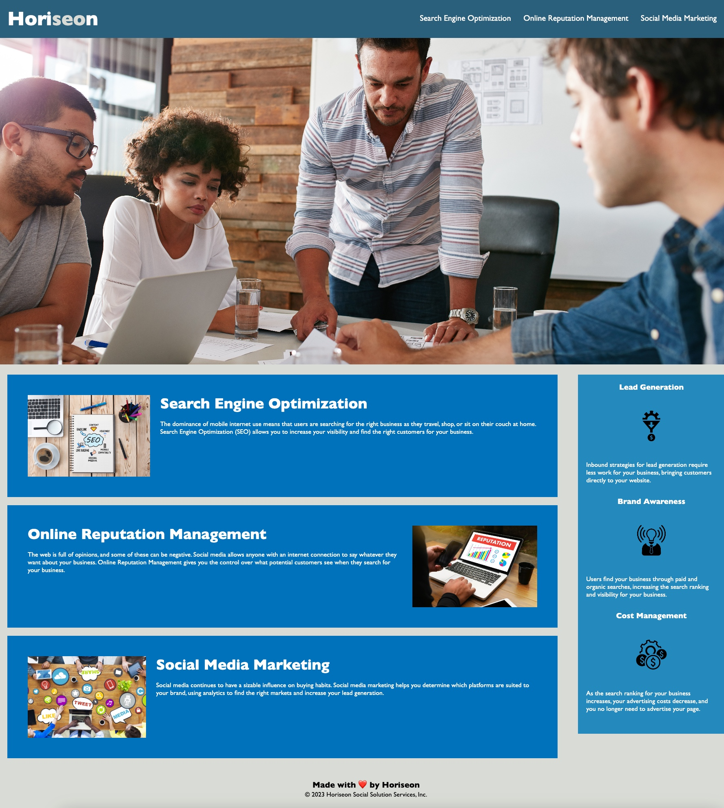

# Horiseon Social Solutions: Code Refactor

## Description
This weeks challenge required the refactoring of code for marketing agency, Horiseon Social Solutions Services. The purpose of this project was to improve the codebase in order to meet accessibility standards and optimise the site for search engines (SEO). With the increasing demand for accessiblity, modifications to existing code are required to provide all users the ability to easily access and interact with websites.

## Objectives
This task required the source code follow a logical structure, independent of CSS, using semantic HTML elements. Accessibility issues needed to be addressed through the addition of alt attributes on all images and icons. A descriptive title was also necessary, as well as a sequential order of heading attributes, to meet acessibiility standards and ultimatley enhance the SEO value of the website.

### To meet the requirements the following refactoring was implemented:

#### HTML:
- Added a new title that is more descriptive for identification and enhanced SEO. 
- Added a viewport meta tag which will be used to add responsiveness to the webpage at a later date
- Replaced unsemantic `
` tags with `<header>`, `<nav>`, `<figure>`, `<main>`, `<aside>` and `<section>`
- Added alternative attributes to images and icons found in the `main` and `aside` sections. The hero-image was unable to hold an alt attribute as it is not a HTML element but rather CSS
- Annotated the HTML file
- Links tested and confirmed for functionality

#### CSS:
- CSS file is commented, with similar properties grouped under headings and consolidated to follow semantic structure
- Font-family property was moved to the universal selectors to decrease repetitiveness
- The `.header`, `.content`, `.benefits` and `.footer` classes became void when changed from `div` and are now identifiable as elements (`header`, `main`, `aside` and `footer`)
- Repetition of class names were consolidated in to a singular `.benefits` for the `<main>` section and `<.services>` in the `aside`

## Screenshot

## Deployed Application

View deployed application [here](https://jayabaldwin.github.io/module-01-challenge/index.html)!

## License

This project is licensed under the [MIT License](https://github.com/jayabaldwin/module-01-challenge/blob/main/LICENSE).
